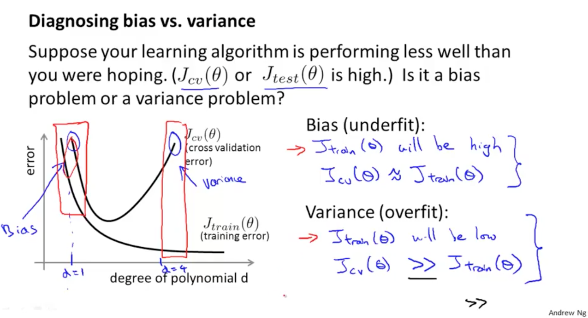
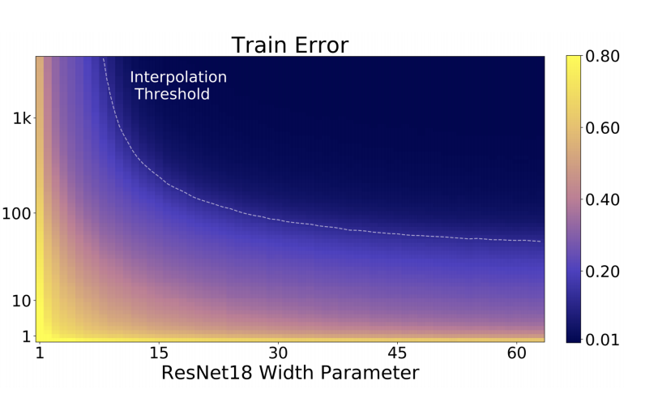
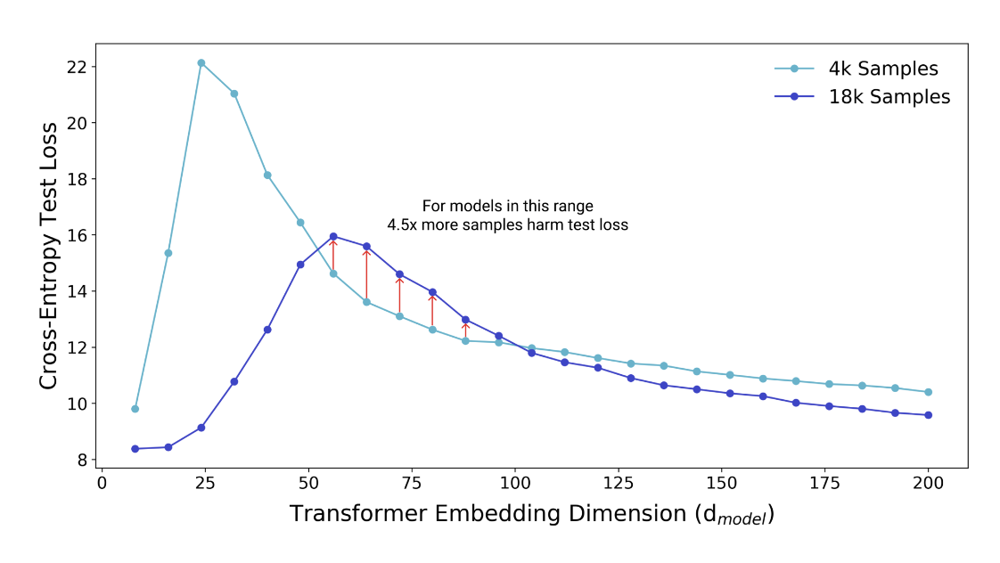
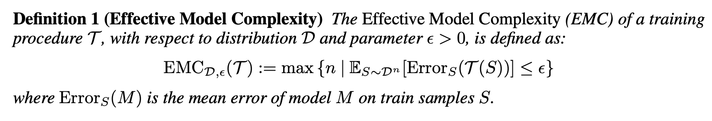
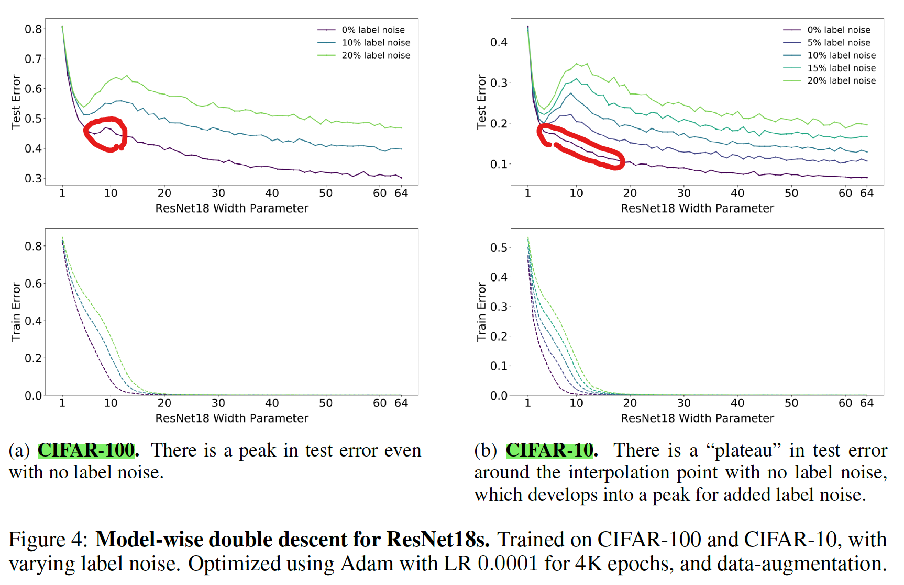
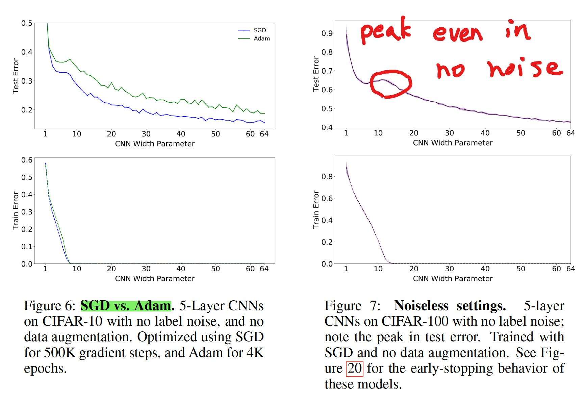
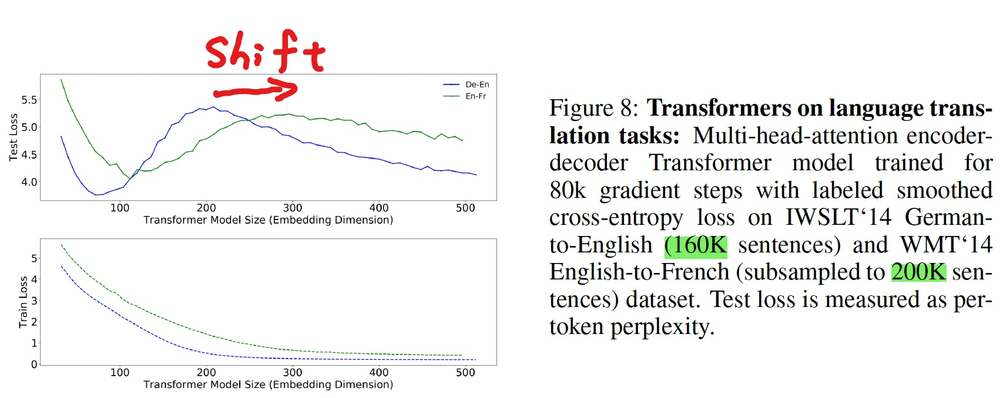
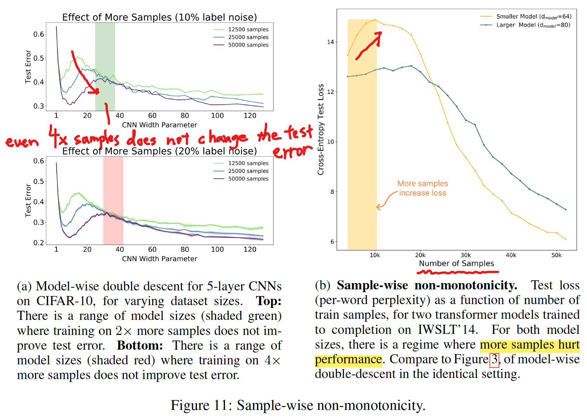
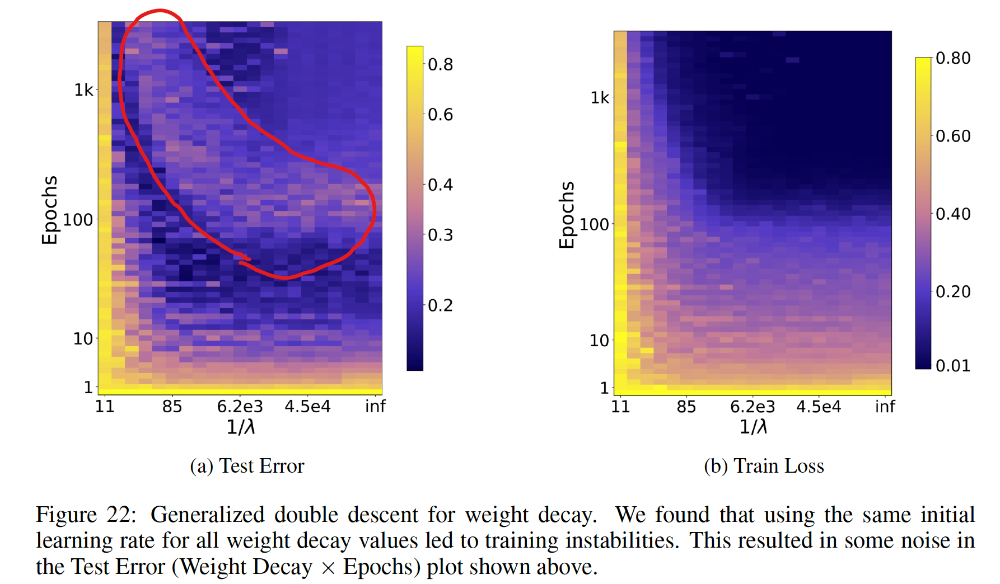
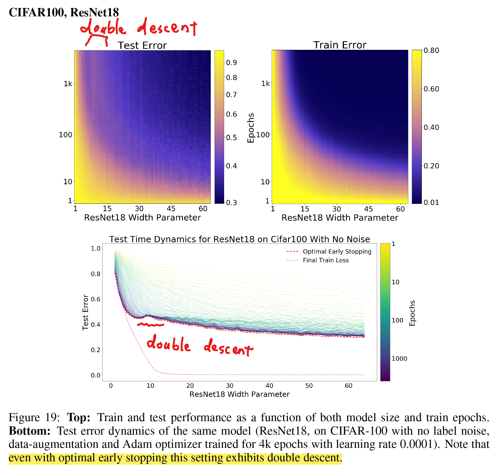

DEEP DOUBLE DESCENT: WHERE BIGGER MODELS AND MORE DATA HURT

* Submitted on arxiv: 2019-12-04
* Links:
  * ICLR 2020: https://iclr.cc/virtual_2020/poster_B1g5sA4twr.html
  * arxiv: https://arxiv.org/abs/1912.02292
* Authors: Harvard University と OpenAI (GPT モデルを作ったところ) のグループ

* Date: 2020-10-11
* Speaker: hnishi

***

## 概要

* 近年の Deep Learning Model では、パラメータ数が大きいほどパフォーマンスがよくなる傾向がある
* この傾向は、古典的な Bias-Variance Trade-off の概念とは矛盾している
* トレーニングサンプル数よりもモデルの複雑さを上げることで、過学習の先に、さらにパフォーマンスが改善する現象 (Double Descent) が Deep Learning Models において広く起こることを証明した

---

* Double Descent を Effective Model Complexity という指標を用いることで説明した
* この論文で示される経験的な証拠は、従来の知恵を再整理し、刷新する内容であると考えられる

---

**[補足] Bias-Variance Trade-off**

> The bias-variance trade-off is a fundamental concept in classical statistical learning theory (e.g., Hastie et al. (2005)).

* 機械学習の教科書に登場する伝統的、古典的な内容
* underfitting (high bias) と overfitting (high variance) のバランスを取れたモデルを作るべき
* 正則化項をつけて overfitting を起こりにくくするなどの工夫がされてきた

---

---

---

References:

* [Bias–Variance Trade-off](https://medium.com/@6453gobind/bias-variance-trade-off-87986b5b5add)
* [Diagnosing Bias vs. Variance &#8211; Deep Learning Garden](https://deeplearning.lipingyang.org/2016/12/21/diagnosing-bias-vs-variance/)

---

**[補足] GTP-3 は 1750億個のパラメータを持つ巨大なモデル**

Ref: [GPT-3: The New Mighty Language Model from OpenAI](https://mc.ai/gpt-3-the-new-mighty-language-model-from-openai-2/)

***
***

## Introduction

---

### 伝統的に知られているコンセプトと近年 DL model に見られる現象の乖離

* 伝統的な Bias–Variance Trade-off の考えかたでは、モデルを複雑にするほどパフォーマンスは悪くなる（過学習）と考えられてきた
* つまり、「より大きなモデルは、より悪いモデルとなる」と理解されてきた

> “larger models are worse.”

---

* modern neural networks では、そのような現象は観測されていない
* この界隈の practitioners の間で上記のことから「より大きなモデルは、より良いモデルとなる」ということが知られてきた

> "larger models are better"

---

* トレーニング時間がテストエラーに与える影響も議論されてきた
* “early stopping” でテストエラーを小さく場合もあるし、それを使わずにトレーニングエラーが 0 になるまで学習する場合にパフォーマンスがよくなる場合もある
* 最終的な、classical statisticians と deep learning practitioners の共通認識としては、「より多くのデータを使うべし」ということであった

> “more data is always better”

***
***

### 結果の概要 (詳細は後述)

---

---

Figure 1 Left: Train and test error as a function of model size, for ResNet18s of varying width on CIFAR-10 with 15% label noise.

---

* double descent が観測されている
* パラメータ数を interpolation threshold (後述) より大きくするとテストエラーは低くなる
* interpolation threshold より左側は、古典的な bias-variance trade-off の concept に従う挙動をする
* interpolation threshold より右側は、モダンな Deep Learning モデルが示すようにパラメータ数が大きいほど、パフォーマンスが良くなる挙動を示す

---

---

Figure 1 Right: Test error, shown for varying train epochs. All models
trained using Adam for 4K epochs. The largest model (width 64) corresponds to standard ResNet18.

---

* early stopping は interpolation threshold 付近の Critical Regeme と呼ばれる領域でのみ有効で、その他の領域ではあまり効果がない
* Critical Regeme (interpolation thredhold 付近) では、epoch 数が大きいほどパフォーマンスが悪くなるが、それ以外の領域では、epoch 数が大きいほど良くなる

---

---

Figure 2 Left: Test error as a function of model size and train epochs. The horizontal line corresponds to model-wise double descent–varying model size while training for as long as possible. The vertical line corresponds to epoch-wise double descent, with test error undergoing double-descent as train time increases.

---

* パラメータ数を大きくすることで Model-wise double descent を観測
* epoch 数を大きくすることで Epoch-wise double descent を観測

---

* トレーニングエラーは単調減少

---

---

Figure 3: Test loss (per-token perplexity) as a function of Transformer model size (embedding dimension d_model) on language translation (IWSLT‘14 German-to-English). The curve for 18k samples is generally lower than the one for 4k samples, but also shifted to the right, since fitting 18k samples requires a larger model. Thus, for some models, the performance for 18k samples is worse than for 4k samples.

---

* 4,000 samples と 18,000 samples で比較
* 基本的にはサンプル数が大きい方がテストエラーは小さい
* 18k samples では全体的に右にシフトしているが、より大きなサンプル数に fitting するためにはより多くのパラメータが必要なため
* 一部のモデルサイズ領域 (赤線矢印の箇所) ではサンプル数が少ないほうがよいパフォーマンスを示す

***
***

## 実験の詳細

様々な条件で実験を行った結果、それぞれに特徴的な double descent の挙動が観測された。

その詳細に関して、以下では説明する。

---

### 手法

---

* Architectures

  * ResNets
    * a family of ResNet18s
    * layer widths [k; 2k; 4k; 8k] for varying k
    * the standard ResNet18 corresponds to k = 64

---

* Architectures (continued)
  * Standard CNNs
    * a simple family of 5-layer CNNs, with 4 convolutional layers of widths [k; 2k; 4k; 8k] for varying k, and a fully-connected layer
  * Transformers
    * the 6 layer encoder-decoder
    * modifying the embedding dimension $d_{model}$ , and setting the width of the fully-connected layers proportionally (dff = 4dmodel).

---

* Datasets
  * CIFAR-10, CIFAR-100, IWSLT'14 de-en, WMT'14 en-fr
* Optimizers
  * SGD, Adam
* その他
  * data augmentation
  * label noise
  * early stopping

---

より詳細が知りたい場合は論文の Appendix B を参照

---

### Effective Model Complexity (EMC)

> We define the effective model complexity of T (w.r.t. distribution D) to be the maximum number of samples n on which T achieves on average ≈ 0 training error.

---

* EMC は、トレーニング手順（モデルパラメータ数、epoch 数、その他）に依存
* EMC = トレーニングエラーが $\epsilon = 0.1$ 以下となる最大サンプル数
* 現状、 $\epsilon = 0.1$ の設定値に根拠はなく、heuristic に決められている

---

### Interpolation Threshold (EMC = n)

EMC と Interpolation threshold に関しては下図をみるとイメージしやすい

---

---

Figure 15: Sample-wise double-descent slice for Random Fourier Features on the Fashion MNIST dataset. In this figure the embedding dimension (number of random features) is 1000.

Ref: [技術ブログ アクセルユニバース株式会社](https://www.acceluniverse.com/blog/developers/2020/01/deep-double-descent-where-bigger-models-and-more-data-hurt.html)

---

> Our experiments suggest that there is a critical interval around the interpolation threshold when EMC = n: below and above this interval increasing complexity helps performance, while within this interval it may hurt performance.

***
***

### MODEL-WISE DOUBLE DESCENT

---

---

* ResNet18s の Width Parameter (モデルサイズ) を大きくしていくと double descent が観測された
* CIFAR-10 の場合、誤ラベル (ノイズ) を導入しなかった場合、double descent は観測されなかったが、CIFAR-100 の場合にはノイズなしでも double descent が観測された
* ノイズが double descent の出現に強く影響を与えている

---

**[補足] Plateau**

> There is a “plateau” in test error around the interpolation point with no label noise

---

Plataue: A comparatively stable level in something that varies.

[Plateau meaning and definition](https://topmeaning.com/english/Plateau)

---

#### Effect of Data Augmentation

---

---

* data augmentation あり、なしで比較
* data augmentation を行うことにより、peak が右にシフトした
* 論文中では議論はないが、data augmentation で interpolation threshold を shift させるのは、augmentation で training sample 数が増えているためか

---

#### Effects of optimizer and noise

---

---

* Adam より SGD の方が、テストエラーが低くなる
  * 論文中、理由に関しては議論はされていない
* ノイズがない場合でも、double descent のピークが出現するケースが有る

---

#### Transformers モデルにおける Dataset の違いが与える影響

---

* より大きいデータセット (En-Fr) を使うと、ピークが右にシフトする

***
***

### EPOCH-WISE DOUBLE DESCENT

---

* モデルサイズは固定し、epoch 数を変えることでも double descent が起こる

---

#### ラベルノイズを載せたときの epoch-wise double descent

---

---

* label noise がない場合は double descent は見られなかった
* label noise がある場合は double descent が見られた

***
***

### SAMPLE-WISE NON-MONOTONICITY

---

---

* トレーニングサンプルの数を変えたときの変化
* サンプル数が大きいほどテストエラーは低くなる傾向がある
* 左図 (a) の網掛け領域では、サンプル数がパフォーマンスに影響を与えていない
* 右図 (b) のように、サンプル数が比較的小さい領域では、サンプル数が大きいほどパフォーマンスが悪くなっている

---

---

* 左図: モデルサイズとトレーニングサンプル数の2次元空間
  * interpolation threshold 付近にピークがある
* 右図: 断面図
  * サンプル数は、小さい/大きいモデルではパフォーマンス改善するが、中間のモデルでは改善しない
* より多くのデータがパフォーマンスを改善しない例は、DNN のみならず Linear Model においても確認されている (Appendix D を参照)

***
***

### 正則化の程度によって起こる double descent (Appendix E.2.2)

---

---

* epoch 数 vs 正則化項の係数 の空間で double descent のようなピークが観測されている
* W-like shape のような感じ？
* 論文では予備的な解析 (preliminary analysis) という位置づけで、深く調査はされていない

---

### Early stopping を使っていても double descent は起こる

---

---

* early stopping を有効にしていても、double descent が起こる例が見られた
* ただし、ほとんどの場合、early stopping は double descent を抑制する

***
***

## 関連する先行研究

---

* Model-wise double descent は [Belkin et al. (2018)](https://www.pnas.org/content/116/32/15849) によって、一般的な現象として、初めて提案された
* それ以前にも、似たような挙動は報告されていた: Opper (1995; 2001), Advani & Saxe (2017), Spigler et al. (2018), and Geiger et al. (2019b)

---

* その後、double descent に関する多くの研究が発表された
  * 追跡可能な線形二乗回帰を使った理論解析: Belkin et al. (2019); Hastie et al. (2019); Bartlett et al. (2019); Muthukumar et al. (2019); Bibas et al. (2019); Mitra (2019); Mei & Montanari (2019)
  * CNN on CIFAR-10 の Model-wise double descent: Geiger et al. (2019a)

---

### Main contributions: 先行研究と比べて何がすごい？（新規性について）

---

* double-descent というアイデアを、パラメータ数のみならず EMC という指標を導入することで拡張し、epoch-wise double descent や sample non-monotonicity のような新しい観点を導いた
* 現代実用されている、幅広い DL の手法において、double-descent が起こることを示した
* double descent が robust phenomenon that occurs in a variety
of tasks, architectures, and optimization methods であることを示した
* early stopping は、critically parameterized された models でのみ役立つことがわかった

***
***

## 結論

---

* under-parameterized regime (モデルの複雑さがサンプル数に比べて小さい領域) では、テストエラーはモデルの複雑さの関数として、U 字型の挙動を示す (the classical bias/variance tradeoff の挙動を示す)
* Over-parameterized regime (モデルの複雑さが十分に大きく zero training error もしくはそれに近い値を達成できる) では、モデルの複雑さをあげることでテストエラーを減少できる (“bigger models are better” の挙動を示す)

---

* Critically parameterized regime では、label noise や model の mis-specification が悪影響を与えやすく、古典的な過学習が起こりやすい
* EMC を導入することで、上記に説明を与えた
* “epoch-wise double descent" を初めて提案した
* より多くのデータを使うことがテストパフォーマンスに悪影響を与える場合があることを示した

***
***

## 議論

---

### double descent が起こる理由

---

* interpolation threshold のモデルサイズは、トレーニングデータに有効的に fit するモデルは１つのみ
* このモデルはトレーニングデータセットのノイズ、またはモデルの誤設定に非常に敏感
* これは、このモデルがかろうじて、トレーニングセットに fit しているためで、すこしでもノイズが入ると、その global structure を壊してしまう
  * 実際に、5 models の ensembling が、critical regime のテストエラーを低くすることが示されている (Figure 28 を参照)

---

* over-parameterized models では、トレーニングセットに fit する多くの interpolating models があり、SGD がノイズを “memorizes” (or “absorbs”) できるモデルを見つけることができる
* 上記の仮説は、線形モデルに関しては理論的な裏付けがあり [(Mei & Montanari (2019))](https://arxiv.org/abs/1908.05355) 、Deep Learning においても拡張できると著者らは考えている

---

### label noise が与える影響

---

* label noise を導入することで double descent が顕著になった
* 著者らは、これが label noise ではなく、model mis-specification に根本的な原因があると主張している

> we view adding label noise as merely a proxy for making distributions
“harder”— i.e. increasing the amount of model mis-specification

---

### 残された課題

* Fully understanding the mechanisms behind model-wise double descent in deep neural networks remains an important open question
* We leave fully understanding the optimal early stopping behavior of double descent as an important open question for future work.
* EMC や既存の手法では location of the double-descent peak を特定できない

***
***

## 参考記事

* [GPT-3が1750億パラメータで構成される理由](https://www.axion.zone/gpt-3-with-175-billion-parameter/)
* [Deep Double Descent](https://openai.com/blog/deep-double-descent/)
* [University of Washington の教授による解説](https://twitter.com/daniela_witten/status/1292293125440847873)
* [技術ブログ アクセルユニバース株式会社](https://www.acceluniverse.com/blog/developers/2020/01/deep-double-descent-where-bigger-models-and-more-data-hurt.html)
